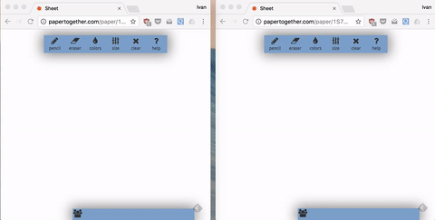
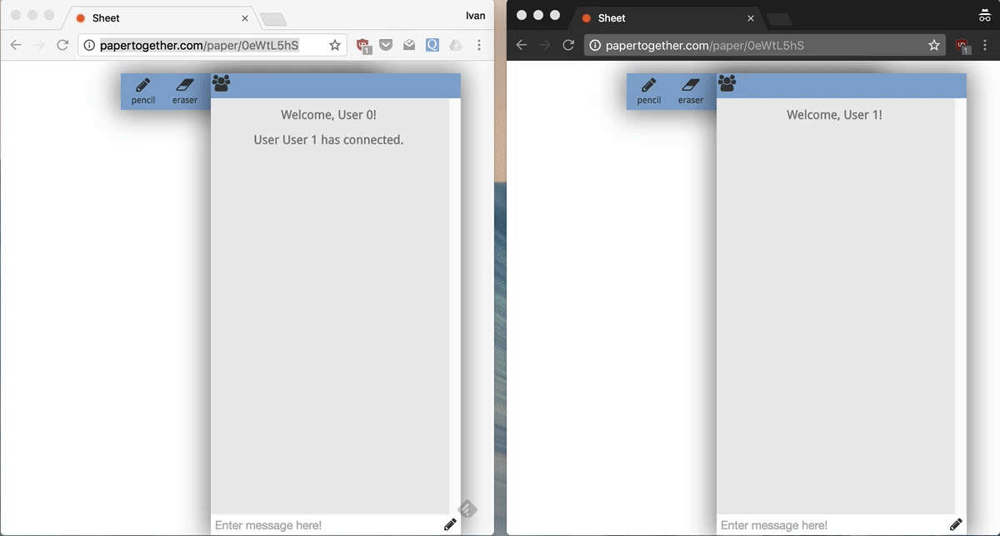

## Summary

This project is a real-time collaborative online whiteboard. Sort of like Google docs, but for drawing. Unfortunately a live demo is no longer available.

### If you want to try it drawing...
Go to the above url (or click [here](http://papertogether.com/)) and click the "Create a Sheet" button. After the subsequent page loads, you can immediately start drawing. If you want to test out how real-time it actually is, you can open another tab next to the one you already have, and copy/paste the page's URL into that one. When you draw on either of the instances of that page, your edits should show up in real time.

### Real time chat too

There is also a real time chat (a-la-facebook messenger), with LaTeX rendering as well.

### Technologies used

* C# ASP.NET MVC
* SignalR for sockets
